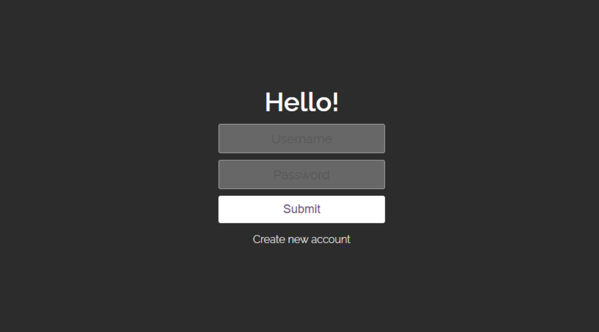
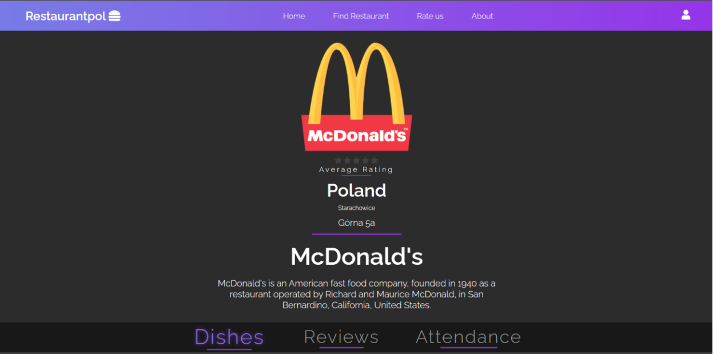
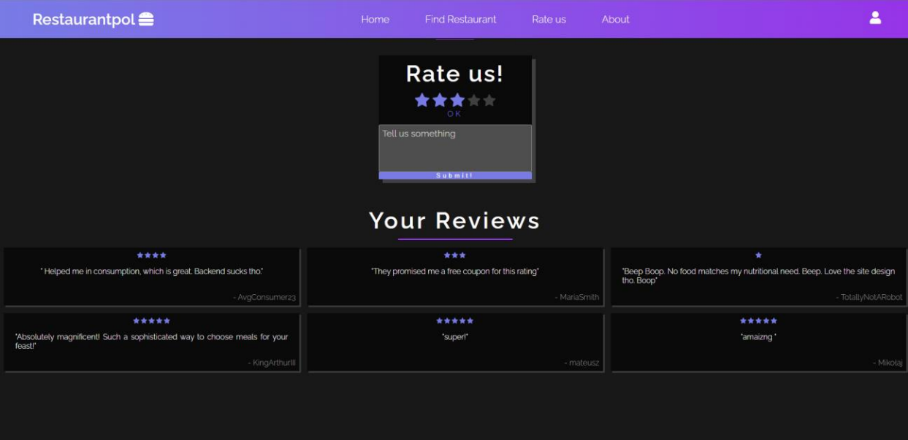

# Documentation

### Projekt z przedmiotu Programowanie aplikacyjne:

### " Aplikacja odpowiedalna za zarządzanie restauracjami na terenie Polski "

### Skład zespołu:

- Latosek Bartosz
- Olejnik Mikołaj

## Autoryzacja

Po uruchomieniu web-aplikacji przechodzimy do strony startowej autoryzacji, na której
mamy możliwość zalogowania się na konto (rys. 1.1) lub zarejestrowania nowego (rys. 1.2).
Podczas rejestracji musimy wskazać swoje imię, nazwisko, e-mail, username, password.

  

  

## Strona główna

Po zalogowaniu przenosimy się na stronę główną, na której widzimy na górze po środku
pasek nawigacji i napis powitalny. Również w prawym górnym rogu widzimy ikonę użytkownika,
po kliknięciu na którą, pojawia się pasek narzędzi (rys. 2.1). Wszystkie przyciski oprócz ustawień
profilu użytkownika nie są działające dlatego, że praca nad nimi nie została jeszcze zakończona.
W ustawieniach użytkownika można wprowadzać wszelkiego rodzaju zmiany, aż do usunięcia
konta (rys. 2.2).

## Szukaj restauracji

Główna funkcjonalność web-aplikacji znajduje się w zakładce Find Restaurant,
przechodząc do której można zobaczyć mapę miejscowości i oznaczone na niej dostępne w
naszej bazie danych restauracje (rys. 3.1). Na stronie znajduje się również pełna lista restauracji,
i po kliknięciu na jedną z nich możemy zapoznać się z jej szczegółowym opisem (rys. 3.2).

## Opis restauracji

Strona restauracji to krótki opis lokalu (rys. 4.1), a także trzy zakładki: Dishes, Reviews,
Attendance. Po kolei: w zakładce Dishes widzimy dania, które przedstawia wybrany zakład (ich
cenę, opis i zdjęcia) (rys. 4.2). W zakładce Reviews są opinie klientów, możemy również zostawić
swoją opinię, będzie ona wyświetlana w imieniu użytkownika, który jest autoryzowanyi (rys. 4.3).
Na podstawie pozostawionych ocen powstaje Średnia ocena prezentowana w skali od 1 do 5. W
zakładce Attendance znajduje się histogram - oczekiwana frekwencja w danym dniu w
zależności od czasu (rys. 4.4). W przypadku, gdy nie można załadować danych lub dane są
ładowane, widzimy napis Loading.

## Ocena web aplikacji

Dalej jest zakładka Rate us (rys. 5.1). W tej sekcji użytkownik może zostawić feedback
odnoszący się wyłącznie do aplikacji (ocenić od 1 do 5 i zostawić miły komentarz). Użytkownik
także może zobaczyć komentarze, pozostawione przez innych ludzi.

## Dodatkowe

Zakładka About zawiera bardzo krótki opis aplikacji.

Z konta administratora strona ogólnie wygląda podobnie, ale są niektóre różnice. Po
pierwsze, można dodawać restauracje, a także zmieniać menu. Co więcej, można edytować
komentarze innych użytkowników.

